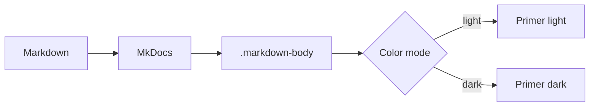
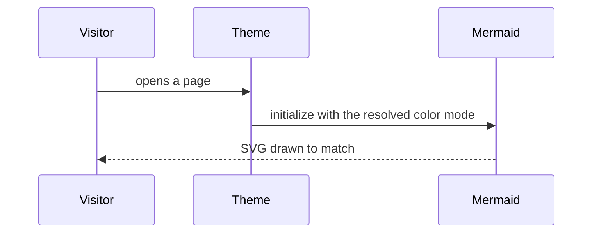

# Diagrams

Diagram plugins hand the theme an SVG they have already colored. That makes them
the one family where a theme with a light/dark toggle has something to get
wrong.

## Mermaid

[mkdocs-mermaid2-plugin][mermaid2] renders diagrams in the browser:





### Two things to get right

**Use `fence_mermaid`, not `fence_mermaid_custom`.** Most recipes on the web are
written for Material, where `fence_mermaid_custom` is correct: it publishes
`window.mermaidConfig` and lets Material's own loader run Mermaid. Under any
other theme nothing runs it, so the page ends up with the diagram source sitting
in a `<pre>` and no error to explain why.

```yaml
markdown_extensions:
  - pymdownx.superfences:
      custom_fences:
        - name: mermaid
          class: mermaid
          format: !!python/name:mermaid2.fence_mermaid
```

**Pass the color mode as a JavaScript expression.** mermaid2 treats a leading
`^` in an argument as a literal to drop into the page rather than a string, so
the theme can be decided when Mermaid initializes:

```yaml
plugins:
  - mermaid2:
      arguments:
        theme: >-
          ^(function () {
            var mode = document.documentElement.getAttribute('data-color-mode')
            if (mode === 'dark') return 'dark'
            if (mode === 'light') return 'default'
            return window.matchMedia && window.matchMedia('(prefers-color-scheme: dark)').matches
              ? 'dark' : 'default'
          })()
```

!!! warning "Diagrams follow the mode on load, not on toggle"
    Mermaid writes its palette into the SVG when it draws, so flipping the
    header toggle leaves an already-drawn diagram behind. Redrawing it would
    mean calling Mermaid again, and mermaid2 loads Mermaid 10 as an ES module —
    the API is scoped to that module and no page script can reach it. Reloading
    picks up the new mode.

    The theme fires a `primer:color-mode-change` event on `document` for
    anything that *can* repaint itself:

    ```js
    document.addEventListener('primer:color-mode-change', function (e) {
      console.log(e.detail.mode, e.detail.resolved)  // 'auto' | 'light' | 'dark'
    })
    ```

## Charts

[mkdocs-charts-plugin][charts] renders Vega-Lite specs. It needs the vega
libraries in `extra_javascript`:

```vegalite
{
  "$schema": "https://vega.github.io/schema/vega-lite/v5.json",
  "description": "Theme-relevant plugins by what they need from a theme.",
  "data": {
    "values": [
      {"kind": "Renders nothing without theme support", "count": 6},
      {"kind": "Needs only well-formed HTML", "count": 12},
      {"kind": "Never reaches a template", "count": 3}
    ]
  },
  "mark": {"type": "bar", "cornerRadiusEnd": 2},
  "encoding": {
    "y": {"field": "kind", "type": "nominal", "sort": "-x", "title": null},
    "x": {"field": "count", "type": "quantitative", "title": "Plugins"}
  }
}
```

Two notes for a non-Material theme:

- It measures the chart width from a parent it recognises by class name —
  `md-content` under Material, `col-md-9` under the built-in theme. It finds
  neither here and falls back to a fixed 800px, so `theme.css` caps the rendered
  SVG at `max-width: 100%` to keep it inside a narrow viewport.
- Its dark mode reads Material's `data-md-color-scheme`, and otherwise falls
  back to the operating system's preference. So a chart follows your OS, but not
  the header toggle. `vega_theme` and `vega_theme_dark` set which Vega themes it
  picks between.

## Why this is not on the main site

Mermaid parses its source line by line, and the main documentation site runs
[mkdocs-minify-plugin][minify] with `minify_html: true`, which collapses the
newlines inside the container. The result is not an error message anywhere in
the build — it is a diagram that renders as **Syntax error in text**, or a
sequence diagram flattened into one unreadable row.

`htmlmin`, which that plugin uses, only preserves whitespace inside `<pre>` and
`<textarea>`. Mermaid's container is a `<div>`, and widening `pre_tags` to cover
every `<div>` would leave nothing for the minifier to do. So the two get
separate sites. Vega-Lite is unaffected — its payload is JSON, which does not
care about whitespace.

## Diagram plugins that need a toolchain

These render server-side and are not enabled here, because each needs something
beyond `pip install` that CI would have to provide: a Kroki or PlantUML server
for [mkdocs-kroki-plugin][kroki] and [mkdocs-build-plantuml-plugin][plantuml],
the `d2` binary for [mkdocs-d2-plugin][d2], the draw.io desktop app for
[mkdocs-drawio-exporter][drawio]. All four emit plain SVG or `` into the
page, so there is nothing theme-specific left for them to get wrong.

[charts]: https://timvink.github.io/mkdocs-charts-plugin/
[d2]: https://github.com/landmaj/mkdocs-d2-plugin
[drawio]: https://github.com/LukeCarrier/mkdocs-drawio-exporter
[kroki]: https://github.com/AVATEAM-IT-SYSTEMHAUS/mkdocs-kroki-plugin
[mermaid2]: https://mkdocs-mermaid2.readthedocs.io/
[minify]: https://github.com/byrnereese/mkdocs-minify-plugin
[plantuml]: https://github.com/christo-ph/mkdocs_build_plantuml

[Back to the documentation](https://olegshulyakov.github.io/mkdocs-primer/).
